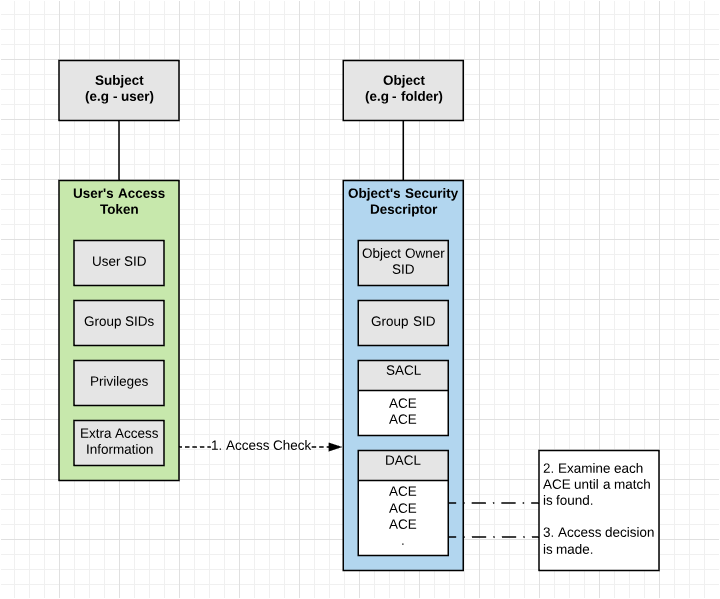

# 1. Windows访问控制模型

访问控制模型提供了可以控制进程访问安全对象或执行各种系统管理任务的能力。

## 开始之前

平日中我们使用的Windows操作系统时，最常见的操作就是登陆系统（如图1-1），那么在这个登陆过程中到底发生了什么？

当我们登陆系统时填写一个密码，当密码正确时我们便会进入操作系统，如图1-2

其实这个时候操作系统将登陆凭证缓存到系统中，方便系统重复调用，避免用户重复输入密码。但是如何保障这一套机制准确无误的执行下去，就是我们本书想要表达的内容。

## 访问控制模型的组成

访问控制模型有两个基本部分：

1. 访问令牌（Access tokens）：包含了有关已登录用户的信息（与特定的windows账户关联）
2. 安全描述符（Security descriptors）：包含了保护安全对象的安全信息（与被访问对象关联）

用户登录时，系统会验证用户的帐户名和密码。如果登录成功，系统将创建一个访问令牌，用户通过使用令牌的副本去创建和访问进程。访问令牌包含安全标识符，这些标识符标识用户帐户以及用户所属组。令牌还包含用户或用户组所拥有的权限列表。当进程尝试访问安全对象或执行需要特权的系统管理任务时，系统将使用此令牌来标识关联的用户是否拥有相应的权限。

创建安全对象后，系统会为其分配安全描述符，该描述符包含由其创建者指定的安全信息，如果未指定，则为默认安全信息。应用程序可以使用函数来检索和设置现有对象的安全性信息。

安全描述符标识指出对象的所有者，并且还可以包含以下访问控制列表：

1. discretionary access control list（DACL）: 用于标识哪些用户和组对目标对象有访问权限
2. system access control list（SACL）: 用于记录对安全对象访问的日志

ACL包含访问控制项（access control entries）（ACEs）的列表。每个ACE指定一组访问权限，并包含一个SID，用于标识其权限被允许、拒绝或审核的受托者。受托者可以是用户帐户、组帐户或登录会话。

**Windows访问控制流程图**

 当一个线程尝试去访问一个对象时，系统会检查线程持有的令牌以及被访问对象的安全描述符中的DACL。 如果安全描述符中不存在DACL，则系统会允许线程进行访问。如果存在DACL，系统会顺序遍历DACL中的每个ACE，检查ACE中的SID在线程的令牌中是否存在。以访问者中的User SID或Group SID作为关键字查询被访问对象中的DACL。顺序：先查询类型为DENY的ACE，若命中且权限符合则访问拒绝；未命中再在ALLOWED类型的ACE中查询，若命中且类型符合则可以访问；以上两步后还没命中那么访问拒绝。

#### 

